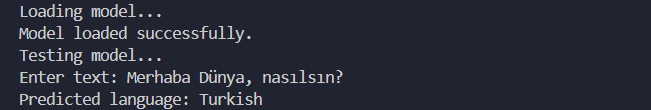

## Overview

This language prediction model aims to predict the language of input text. It utilizes a deep learning architecture consisting of an encoder-decoder model. The model is trained on a dataset of text samples from various languages.

## Dataset

This dataset contains 22 languages, 1000 text samples for each language.
⦁ English
⦁ Arabic
⦁ French
⦁ Hindi
⦁ Urdu
⦁ Portuguese
⦁ Persian
⦁ Pushto
⦁ Spanish
⦁ Korean
⦁ Tamil
⦁ Turkish
⦁ Estonian
⦁ Russian
⦁ Romanian
⦁ Chinese
⦁ Swedish
⦁ Latin
⦁ Indonesian
⦁ Dutch
⦁ Japanese
⦁ Thai

## Example Use
To train the model, first run:
` python main.py `

Then to test an input, run:
` python main.py --test `

The pre-trained model will be loaded. You can input a sentence here (it can contain punctuation marks or special characters of the languages in the dataset). The model will make a prediction. The chances of model predicting right is highly associated with the length of the sentence.

